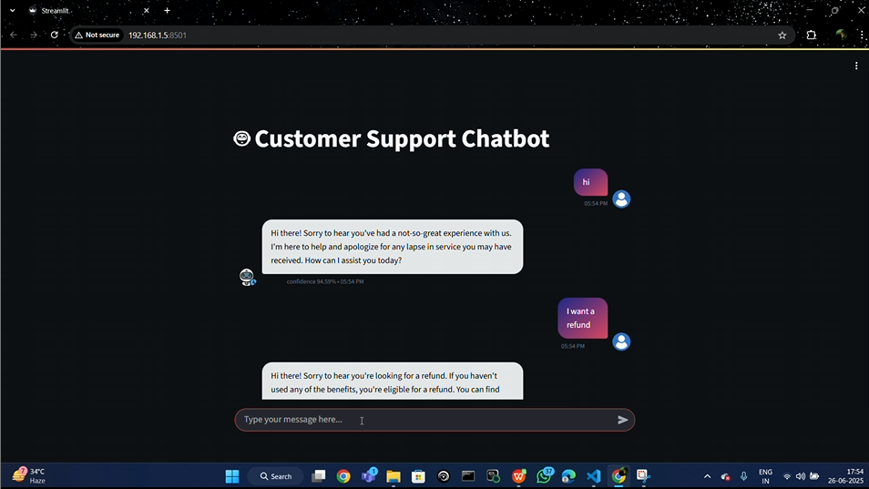

## 🤖 Customer Support Chatbot

### 🚀 Objective  
Build an intelligent chatbot that can answer customer queries by leveraging a large dataset and contextual search using vector embeddings and LLMs.

---

### 🧰 Tools Used  
- Python  
- Streamlit  
- LangChain  
- FAISS  
- HuggingFace Sentence Transformers  
- Groq LLM  
- dotenv  
- Pandas

---

### 🔍 Key Steps  
- Load customer chat data from a `.csv` file  
- Generate `intents.json` from raw conversations  
- Chunk and embed textual data using Sentence Transformers  
- Store embeddings in a FAISS vectorstore  
- Retrieve relevant context during inference using similarity search  
- Use Groq's LLaMA-3 model to respond with contextual accuracy  
- Display the chatbot with a Streamlit UI

---
# 🎛️ Chatbot Simulation
<p align="left">
<a href="https://youtu.be/_EDkwbUeWZs?si=c-WnGQFxeSmD3kQA" target="blank"></a>
    
---

### 📁 Folder Structure

```plaintext
├── chatbot.py                     # Streamlit chatbot interface
├── connect_memory_with_llm.py     # Run LLM with vector retrieval
├── create_memory_for_llm.py       # Create vector DB from intents
├── intent_generation.py           # Convert CSV to intents.json
├── requirements.txt               # All Python dependencies
├── .env                           # Contains GROQ_API_KEY
│
├── data/
│   ├── chatbot_data.csv           # Raw customer support data
│   └── intents.json               # Auto-generated intent file
│
├── vectorstore/
│   └── db_faiss/
│       ├── index.faiss
│       └── index.pkl
│
├── venv/                          # Virtual environment folder (optional)
```

---

### ⚙️ How to Run

#### 1. Clone the Repository

```bash
git clone <your-repo-url>
cd <repo-folder>
```

#### 2. Create a Virtual Environment & Install Dependencies

```bash
python -m venv venv
source venv/bin/activate        # Windows: venv\Scripts\activate
pip install -r requirements.txt
```

#### 3. Add Your Groq API Key  
Create a `.env` file in the root folder and add:

```
GROQ_API_KEY=your_groq_api_key_here
```

Also, paste the same key in `connect_memory_with_llm.py` where marked.

#### 4. Prepare Your Data  
Ensure your CSV file is in `data/chatbot_data.csv`.

#### 5. Generate Intents

```bash
python intent_generation.py
```

#### 6. Create Vector Database

```bash
python create_memory_for_llm.py
```

#### 7. Launch the Chatbot (Localhost)

```bash
streamlit run chatbot.py
```

Visit [http://localhost:8501](http://localhost:8501) to interact.

---

### 📎 Dataset  
- Custom customer support dataset (`chatbot_data.csv`)
- Includes both inbound queries and responses

---

### 💡 Learnings  
- Built a chatbot using LangChain and Groq's LLM  
- Understood how to chunk and embed custom data  
- Used FAISS for similarity-based retrieval  
- Developed an interactive chat UI using Streamlit  
- Applied `.env` for secure API management  

---

### 🧠 Future Improvements  
- Add authentication and user session tracking  
- Add support for multi-intent classification  
- Deploy chatbot on cloud with persistent vector store

---
